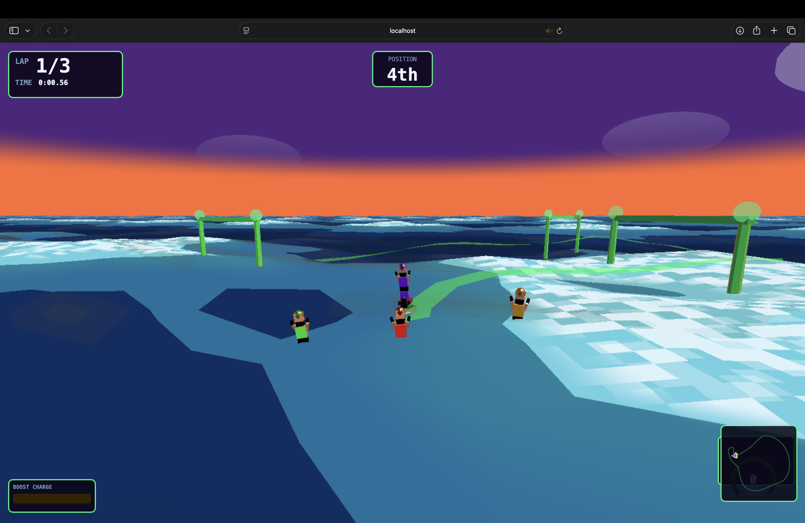
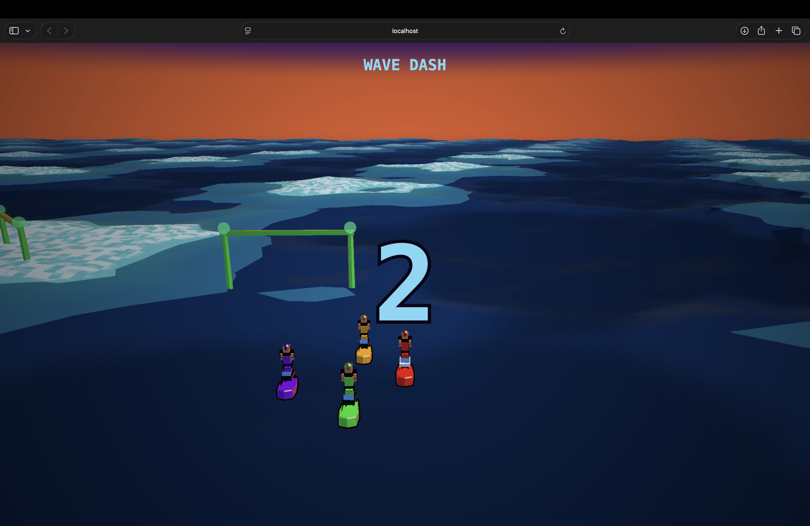

# WAVE DASH 🌊

> **A cel-shaded arcade boat racing game built with Three.js**  
> Anime NPR aesthetics. Gerstner wave ocean. Arcade physics. Zero external assets.




## Quick Start

```bash
npm install
npm run dev
# Open http://localhost:5173
```

## Controls

| Key | Action |
|-----|--------|
| `W` / `↑` | Throttle |
| `S` / `↓` | Brake / Reverse |
| `A` / `←` | Steer Left |
| `D` / `→` | Steer Right |
| `Shift` / `Space` | Drift (hold to charge boost) |
| `R` | Restart (on results screen) |

**Drift mechanic:** Hold `Shift` while turning to drift. Fill the boost meter, then release — the boost fires automatically!

## Race Format

- 4 boats: you (red) vs 3 AI opponents
- 3 laps around a closed ocean circuit
- Countdown start → race → results screen

## Architecture

```
src/
├── core/
│   ├── Engine.ts          # WebGL renderer with adaptive pixel ratio
│   └── AudioSystem.ts     # Web Audio synthesizer (zero external audio)
├── rendering/
│   ├── WaterSystem.ts     # Infinite projected-grid ocean
│   ├── CelPipeline.ts     # Toon ramp + inverted-hull outlines
│   └── Sky.ts             # Gradient dome + cel clouds + sun
├── shaders/
│   ├── water.ts           # 5 Gerstner waves vertex + cel fragment
│   └── cel.ts             # Toon, outline, sky GLSL shaders
├── physics/
│   └── WaveQuery.ts       # CPU-side wave math for buoyancy
├── entities/
│   ├── Boat.ts            # Arcade physics + buoyancy + wake ribbon
│   └── Rider.ts           # Procedural rig + animation
├── race/
│   ├── Course.ts          # CatmullRomCurve3 circuit + gates
│   ├── RaceManager.ts     # Lap/checkpoint/position tracking
│   └── AIRacer.ts         # 3-personality AI with rubber-banding
├── camera/
│   └── ChaseCamera.ts     # Spring-damped chase + FOV kick + shake
└── hud/
    └── HUD.ts             # Canvas HUD: speedo, minimap, boost
```

## Art Direction

**Palette (committed globally):**

| Role | Color |
|------|-------|
| Sky zenith | `#1a0a3a` deep indigo |
| Sky horizon | `#ff6b35` sunset orange |
| Water deep | `#0d3b6e` ocean blue |
| Water mid | `#1e7fa8` aqua |
| Water crest | `#7dd8f7` light blue |
| Player boat | `#ff4040` red |
| AI boats | green / gold / purple |
| Ink outline | `#0a0516` near-black |
| Rim light | `#ff9966` warm orange |

**Shader systems:**
- 4-band step-quantized toon diffuse (tuned thresholds, not defaults)
- Inverted-hull outlines with view-distance scaling
- Fresnel rim light on all entities
- Hard-edge banded specular (no smooth falloff)
- Animated sparkle glitter on water surface
- 5 Gerstner waves (1 swell + 4 chop layers)
- Cel cloud blobs in sky with hard rim edges

## Technical Details

- **Zero external assets** — all geometry procedural, all audio Web Audio API
- **Infinite ocean** — projected grid recenters to camera every frame
- **Buoyancy** — 5 hull points sample real Gerstner height for pitch/roll
- **Wake ribbon** — geometry generated per boat, spreads + fades
- **Adaptive pixel ratio** — starts at 2.0×, lowers under GPU load
- **AI personalities** — aggressive / clean / erratic with rubber-banding

## Stack

- [Vite](https://vitejs.dev/) + TypeScript
- [Three.js](https://threejs.org/) r169+
- Web Audio API (no external audio libraries)
- Vanilla CSS (no frameworks)
